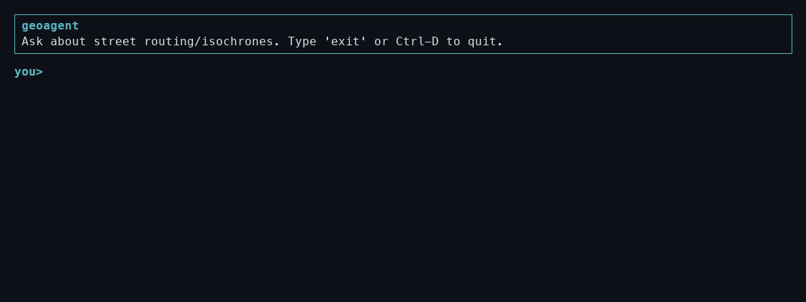
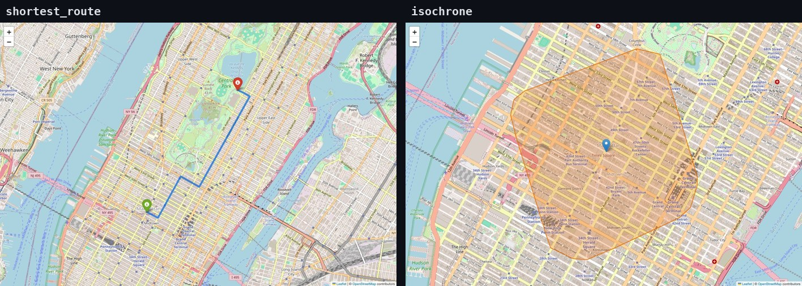
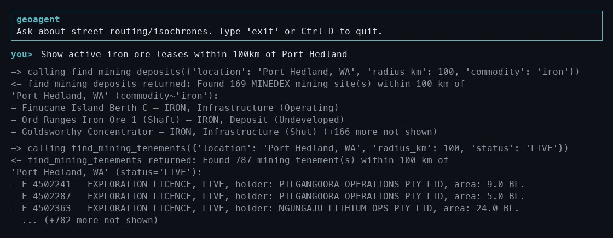
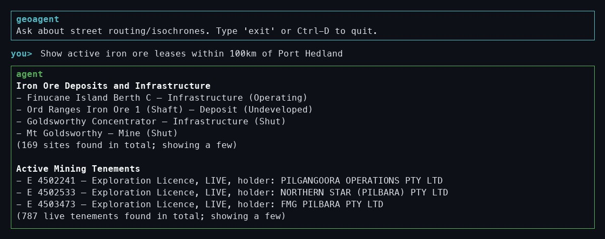
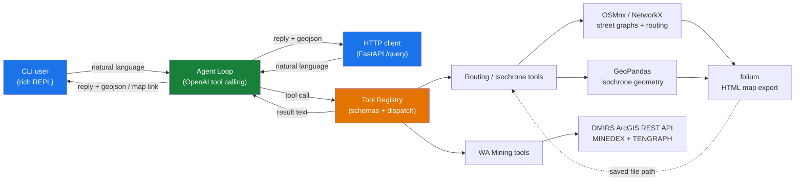

# geoagent

A CLI geospatial AI agent that answers natural-language street-routing questions by
having an LLM call out to OSMnx/GeoPandas-backed tools via OpenAI's native tool
(function) calling — no agent framework involved.



Given a place name or coordinates, it can:

- fetch/summarize a street network graph (`get_street_network`)
- compute shortest-path routes by distance or travel time (`shortest_route`)
- compute reachable-area isochrones (`isochrone`)

Every `shortest_route`/`isochrone` call also auto-exports an interactive HTML map
(via [folium](https://python-visualization.github.io/folium/)) to the local `maps/`
directory, and the agent's reply includes a link to it. `shortest_route` (left, the
route from the demo above) and `isochrone` (right, a 15-minute walk from Times Square)
export differently shaped results — a path vs. a reachable-area polygon:



It can also look up **Western Australian mining data** direct from DMIRS's public,
unauthenticated ArcGIS REST service:

- mines, mineral deposits, and prospects near a place (`find_mining_deposits`, from
  the MINEDEX dataset) — filterable by commodity and/or site type
- mining tenements — legal titles like mining leases and exploration licences — near
  a place (`find_mining_tenements`, from the TENGRAPH system) — filterable by tenement
  type and/or status (live/pending only; historical tenements aren't covered)

These two datasets aren't cross-referenced (tenements carry no commodity data, and
deposits carry no legal title info), so a query like "iron ore leases near X" triggers
both tools and the agent presents them as separate results — with `--debug` on, you can
see both real, live tool calls and their raw results:



...and the final reply the agent composes from them:



## Architecture



`geospatial/` holds pure domain logic (OSMnx/NetworkX/GeoPandas/DMIRS calls) with no
knowledge of OpenAI. `tools/` adapts that into OpenAI tool schemas and lossy,
model-readable text summaries — full data (route coordinates, isochrone polygons)
stays out of the LLM's context but is retained for map export and, via
`tools/geo_context.py`'s context-local collector, for the API's GeoJSON response.
`agent/` only talks to the tool registry's generic interface, so it has no dependency
on OSMnx, GeoPandas, or DMIRS at all — both `cli.py` and `api.py` are thin, swappable
front ends over the same `agent/`/`tools/` core.

## Requirements

- Python 3.10+
- An OpenAI API key with available credits

## Setup

```bash
python3.10 -m venv .venv
source .venv/bin/activate
pip install -e ".[dev]"
cp .env.example .env
```

Edit `.env` and set `OPENAI_API_KEY` to your real key.

## Running

```bash
geoagent
# or: python -m geoagent.cli
```

Type a question at the `you>` prompt, e.g.:

```
you> what's the shortest driving route from Times Square, New York to Central Park, New York?
you> how far can I walk from Times Square, New York in 15 minutes?
```

Flags:

- `--debug` — echo tool calls/results to stderr as they happen
- `--no-cache` — disable OSMnx's disk cache for this run (forces fresh OSM fetches)

Type `exit`, `quit`, or Ctrl-D to leave the REPL.

## API

An optional HTTP microservice wrapping the same agent, for scripting or a future
frontend, is available via [FastAPI](https://fastapi.tiangolo.com/):

```bash
pip install -e ".[dev,api]"
uvicorn geoagent.api:app --reload
```

- `GET /health` — liveness check
- `POST /query` — `{"message": str, "history": [...]}` (both required except
  `history`, which defaults to `[]`) → `{"reply": str, "history": [...], "geojson": {...}}`

The API is **stateless**: it holds no server-side session, so a multi-turn
conversation is continued by passing back the `history` array from the previous
response as the next request's `history`. `geojson` is a `FeatureCollection` built
from whatever routes/isochrones/mining deposits were actually computed during that
turn's tool calls — a `LineString` per route, a `Polygon` per isochrone, a `Point`
per mining deposit. (Mining tenement polygons aren't included yet — that tool
doesn't currently fetch geometry, only attributes.)

```bash
curl -s -X POST localhost:8000/query \
  -H "Content-Type: application/json" \
  -d '{"message": "shortest driving route from Times Square, New York to Central Park, New York"}'
```

## Configuration

All settings are read from environment variables (via `.env`):

| Variable | Default | Purpose |
|---|---|---|
| `OPENAI_API_KEY` | *(required)* | OpenAI API key |
| `GEOAGENT_MODEL` | `gpt-4o-mini` | OpenAI model to use |
| `GEOAGENT_CACHE_DIR` | `.cache/osmnx` | OSMnx disk cache directory |
| `GEOAGENT_MAPS_DIR` | `maps` | Where auto-exported route/isochrone HTML maps are saved |
| `GEOAGENT_MAX_TURNS` | `8` | Safety cap on tool-call loop iterations per user message |
| `GEOAGENT_OVERPASS_URL` | *(unset, use OSMnx default)* | Override the Overpass API mirror |
| `GEOAGENT_OVERPASS_RATE_LIMIT` | `true` | Set `false` to disable OSMnx's Overpass rate-limit slot check |

The last two are only needed if your network can't reach OSMnx's default Overpass
mirror (`overpass-api.de`) — leave them unset to get OSMnx's normal, usage-policy-
respecting behavior. If routing/isochrone tool calls fail with connection errors,
try setting `GEOAGENT_OVERPASS_URL=https://overpass.kumi.systems/api` and
`GEOAGENT_OVERPASS_RATE_LIMIT=false`.

## Testing

```bash
pytest              # unit tests only (fast, no network calls; needs `.[dev,api]` for API tests)
pytest -m integration  # also hits real OSM/Overpass data
```

## Project layout

```
src/geoagent/
├── config.py            # env/settings loading, OSMnx cache configuration
├── cli.py                # REPL entrypoint (rich terminal UI)
├── api.py                # FastAPI microservice entrypoint
├── agent/
│   ├── loop.py            # OpenAI tool-calling loop
│   ├── conversation.py    # message history state
│   └── prompts.py         # system prompt
├── tools/
│   ├── registry.py        # tool schema + dispatch registry (extension point)
│   ├── errors.py          # exception -> structured error string for the model
│   ├── geo_context.py     # context-local GeoJSON feature collector (for api.py)
│   ├── routing.py         # street network / route / isochrone tool wrappers
│   └── wa_mining.py       # MINEDEX / mining tenement tool wrappers
└── geospatial/
    ├── network.py          # OSMnx graph fetch + in-process cache
    ├── routing.py          # shortest-path computation
    ├── isochrone.py        # reachable-area computation
    ├── geocode.py          # place name / "lat,lon" resolution
    ├── mapping.py          # folium HTML map export
    ├── wa_mining.py        # DMIRS ArcGIS REST queries
    └── models.py           # result dataclasses + their model-facing text/GeoJSON summaries
```

To add a new capability (e.g. POI search), add a `geospatial/<feature>.py` module and
a `tools/<feature>.py` that registers its own tool specs — no changes needed to `agent/`.
